# **Product Quantization for Nearest Neighbor Search**

BY Herv´e J´egou, Matthijs Douze, Cordelia Schmid

## 1. Motivation

论文提出了一种乘积量化（Product Quantization, PQ） 的方法来优化近似最近邻搜索的性能（Approximate Nearest Neighbor Search, ANNS）。

最近近邻搜索（Nearest Neighbor, NN）在向量维度高的情况下，计算量非常大。NN的问题可以定义为
$$
for\space D-dimensional\space Euclidean\space space\space \mathbb{R}^D, find\space NN(x),\\ 
in\space a\space finite\space set\space \mathcal{Y}\subset \mathbb{R}^D,minimize\space the\space distance\space to\space x\in\mathbb{R}^D:\\
NN(x) = \arg \min_{y\in\mathcal{Y}}d(x,y)
$$
ANN 的关键在于只需要得到较高概率的最近邻，而不用找到精确的最近邻。ANN 算法通常都是在搜索质量和搜索时间之间做取舍，而没有考虑索引结构需要的存储空间的大小，索引的大小对大数据量来说尤其重要。

为了减少索引的存储空间，此论文提出了PQ的方法来进行向量量化。基于量化的向量，此论文又提出了非对称距离计算（Asymmetric Distance Computation, ADC）的概念，提升了 PQ 在 ANN 的搜索过程的效率。为了避免全量搜索（exhaustive search）, PQ 论文又在 ADC 的基础上结合了倒排索引（Inverted File, IVF），也就是提出了 IVFADC，用以减少向量比较的范围。

## 2. IDEA

PQ 将向量空间分解为低维子空间的笛卡尔积，并且对每个子空间分别进行量化。

#### 向量量化

量化是信息论里广泛研究的内容。

量化器是指将向量 *x* 映射成 *q(x)* 的函数 *q* ， 重建值 *c_i* 被称作 中心点 (*centroids*) 或者码（*code*, *codeword*）， 中心点的集合被称作码本 (*codebook*)，被映射到同一个中心点的向量集合被称作分区（论文作者称之为 *Voronoi cell*）。

向量量化其实可以理解为 *kmeans* 聚类，量化的过程也就是对所有向量进行 *kmeans* 聚类，得到 *k* 个 中心点 *c_i*，每个向量最终会被量化到距离它最近中心点上。存储索引值需要的空间是
$$
\log_2k
$$
所以 *k* 推荐使用 2 的幂次方。

但是向量量化有缺陷。给定 128 维的向量， 如果我们想生成 64-bits 的中心点，也就是每  2 维量化为 1 维，会包括 
$$
2^{64}
$$
个中心点，向量量化是没法创建和存储这么多个中心点的，但是 PQ 可以解决这个问题

#### 乘积量化 （PQ）

PQ 的本质是将原始向量空间分解为 M 子空间的笛卡尔积，并且分别对 M 个子空间量化 *k* 个中心点，这样在原始空间会包含 
$$
k^M
$$
个中心点，可以轻松达到向量量化无法生成的中心点数量。

PQ 首先将 D 维向量 *x* 分为 m 个独立的 D/M 维的子向量 u_j。这 m 个子向量会被 m 个不同的量化器分别量化，也就是说每个子向量会由相应区域中距离最近的中心点ID进行表示。码本由 m 个子码本的笛卡尔积表示
$$
C = C_1 \times ... \times C_m
$$
每个量化器（码本）拥有 *k\** 个 中心点， 对原始空间来说总共的中心点个数为：
$$
k = (k^*)^m
$$
PQ 有两种极端情况，当 *m=1* 时，PQ 就成了 VQ（kmeans），当 *m=D* 时，向量的每个维度都会分别被量化，也就是 SQ （Scalar Quantization），只不过量化函数是不同的。

经过 PQ 量化之后的向量，其存储空间会大幅缩减。论文对 PQ 使用的存储空间和复杂度进行了分析，如下表。

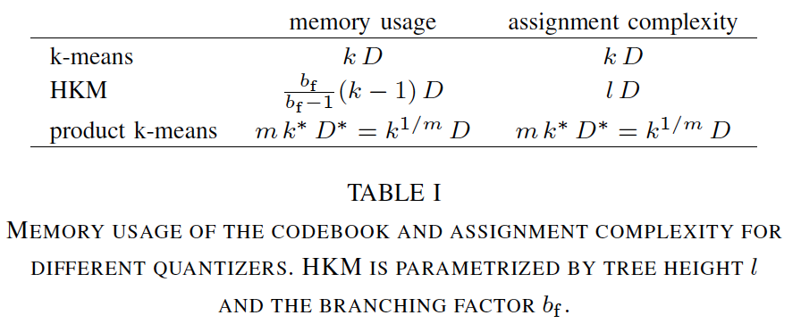

#### 非对称距离计算（ADC）和对称距离计算（SDC）

数据库的所有向量经过 PQ 量化之后，变为了由 m 个 中心点的 ID 组成的序列。为了进行 ANN，需要计算查询向量 q 和数据库向量之间的距离，但已量化的向量直接计算 L2 距离没有任何意义（量化的向量是中心点 ID 序列）。因此PQ 提出了两种距离计算方式: 非对称性距离计算（Asymmetric Distance Computation, ADC）和对称性距离计算（Symmetric Distance Computation, SDC）。

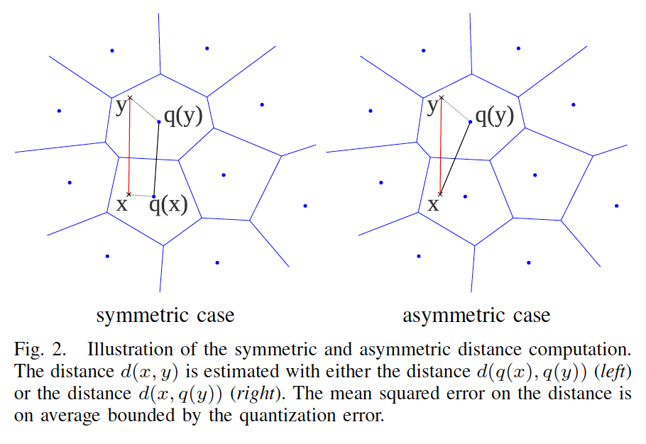

**SDC：** 查询向量 *q* 也会进行 PQ 量化，*q* 的 m 个子向量都会被量化为对应子分区的 *k\** 个中心点中距离最近的那个中心点 ID，然后 *q* 和 数据库的向量 *x* 之间的距离计算就变成了中心点之间的距离计算，而这个距离是可以从提前算好的表中查表得到的。

**ADC：** 查询向量 *q* 无需经过量化，直接与每个中心点进行距离计算。首先需要计算 *q* 的每个子向量和其对应子区域的 *k\** 个中心点计算 L2 距离，也就是创建一个 *k\**  行 （每个中心点一行），*m* 列（每个子空间一列）的距离表。然后再计算 *q* 和数据库中所有向量的距离。 因为每个数据库向量都是 *m* 个中心点的 ID 序列，所以只需要通过这 *m* 个中心点 ID 查表，然后把它们都加起来即可。

SDC 和 ADC 的计算量相同，但是 SDC 查询向量 *q* 会进行一次量化，量化会产生误差，所以 ADC 计算距离的误差会更小一些。

#### IVFADC

SDC 和 ADC 都需要计算 *q* 和数据库中每个向量之间的距离，也就是全量搜索（exhaustive seach）。为了避免全量搜索，减少距离计算的次数，此论文引入了倒排索引（Inverted file）系统。

IVF 在本文中是指对整个数据库使用 kmeans 聚类分成许多的分区，这样在搜索的时候可以只在部分分区搜索。

- 首先对数据库的所有向量进行 kmeans 聚类，得到 *k‘* 个中心点（分区）和 *qc* 量化器。每个向量只属于其中 1 个分区。每个分区都拥有一个属于这个分区的的列表（IVF 列表）。
- 对每个分区使用 PQ 对向量的残差进行量化，残差向量是

$$
r(y) = y - q_c(y)
$$

- 索引结构包括两个部分，向量自己的 ID 和 经过PQ量化后的 m 个中心点的 ID，也就是 id 和 code。

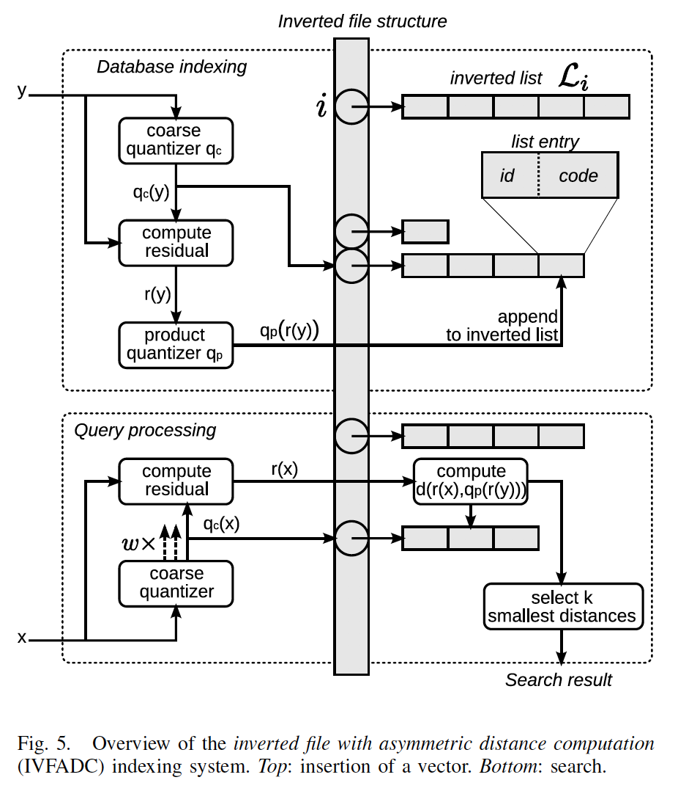

## 3. EXPERIMENT

本论文的实验包括三类，第一类是分析 SDC， ADC 和 IVFADC 的参数对 ANN 的影响，第二类是与时下最新的三种 ANN 方法进行对比实验，最后本论文分析了 PQ 的复杂度和搜索速度。

### 3.1 参数分析

#### 内存占用和搜索准确率的实验

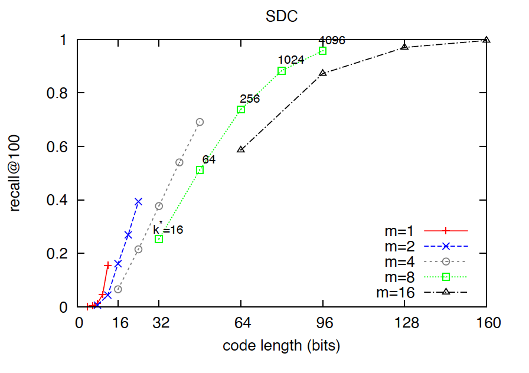

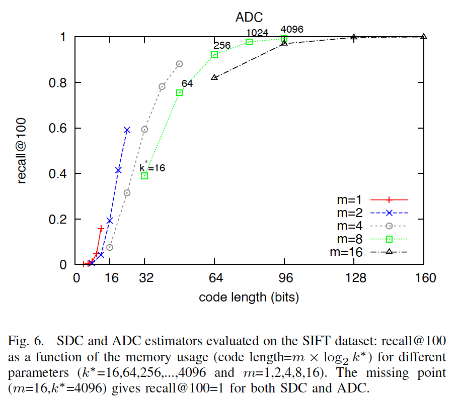

code length 就是存储 1 个量化之后的向量需要的内存空间，论文追求的目标是使用尽可能小的内存空间达到尽可能高的召回率。从实验效果来看，比较推荐的参数选择是 *ADC: m = 8, k\* = 64; SDC: m = 8, k\*=256*。对 IVFADC 来说，*k'*大一些召回率更好

#### 维度组合的影响

前文描述的 PQ 按照维度的顺序来划分子向量，但是类似于 SIFT 和 GIST 的数据集，它们的维度之间相关性不同，组合维度的方式也应该有所差别。本论文针对维度组合进行了一个实验，*natural order* 表示按照维度的顺序进行划分子向量， *random* 表示随机取一些维度进行子向量划分， *structured* 表示将相关的维度组合在一起，实验结果如下：

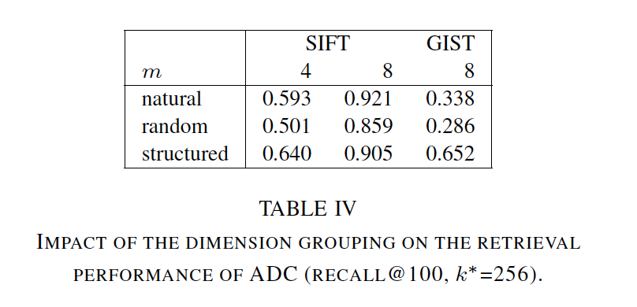

实验结果可以看出维度组合的方式对最终结果的影响非常大，随机取维度进行组合得到的召回率是最低的，按照维度相关性组合成子向量得到的召回率是最高的。

据此论文提出了一个讨论，一个可以自动组合维度的方法可以很大程度提高 PQ 的召回率。这点被之后提出的 OPQ 进行了补充完善。

### 3.2 和最新算法的对比实验

此论文选择的最新算法包括 Hamming embedding（HE），Spectral hasing（SH）和 FLANN

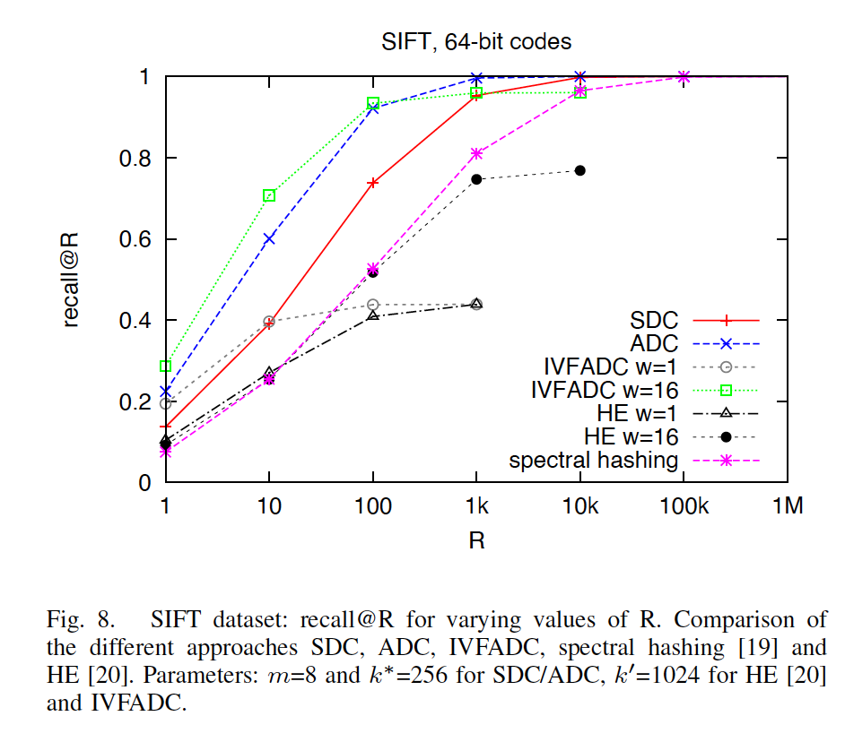

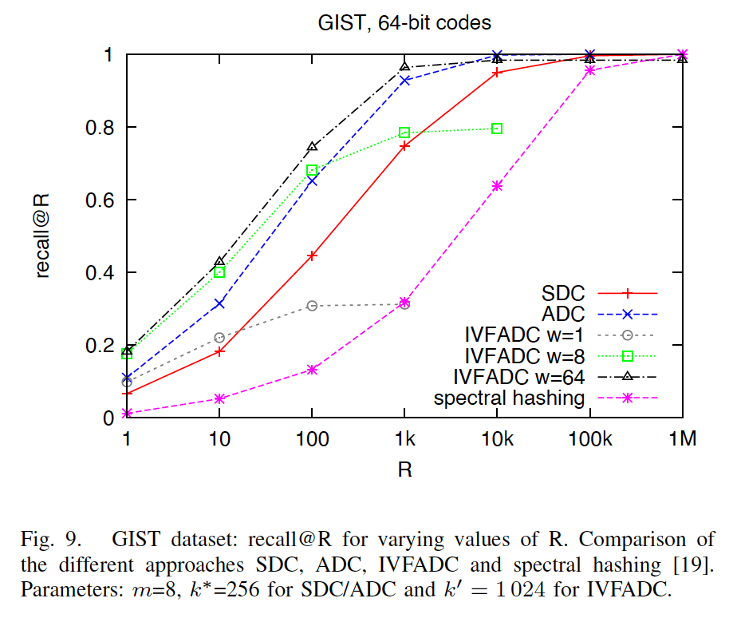

实验效果看来，PQ 的 ADC 要比 SDC 召回率高，IVFADC 的召回率是最高的。同等召回率下，IVFADC 的搜索时间也比 FLANN 少。

### 3.3 复杂度和速度

PQ 论文对 SDC，ADC ，IVFADC 以及 SH 的召回率和对比时间进行了实验，结果如下

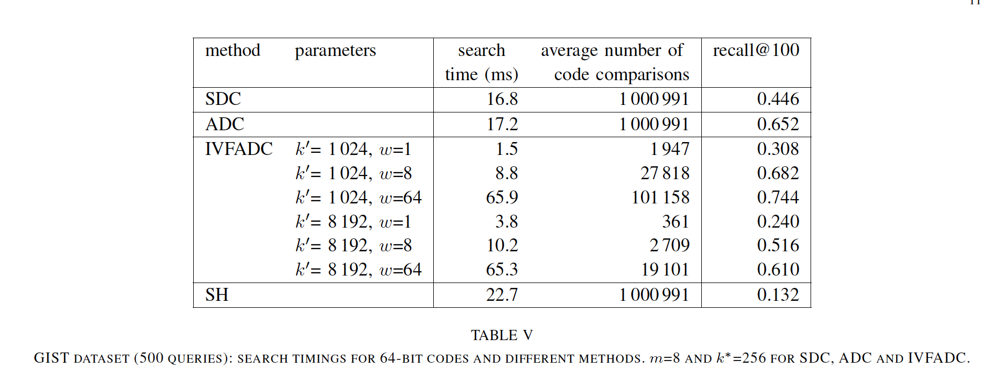

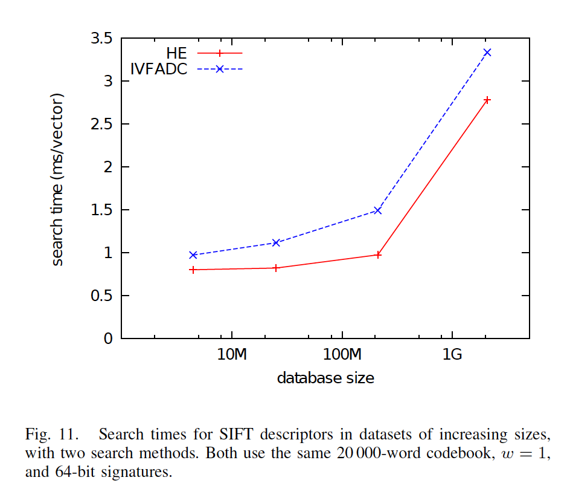

虽然 IVFADC 要稍微慢一些，但是 HE 计算的是二进制汉明距离，IVFADC 计算的是浮点距离。浮点距离的计算能和二进制的距离计算差不多也是证明了 IVFADC 距离计算的速度快。

### 3.4 图像搜索

最后一个实验时在一个图像搜索系统上进行的，对比的算法是 HE，实验结果如图

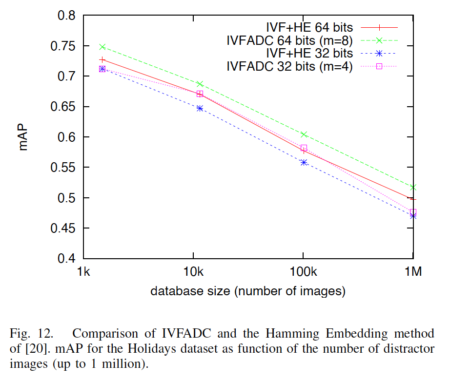

## 4. CONCLUSION

PQ 提出了一种全新的量化向量的方法，基于此量化方法提出了计算欧式距离的精确算法ADC。除此之外，本论文还将 IVF 与 ADC 结合来避免全量搜索，进一步提高搜索效率。根据实验结果而言此论文提出的方法在搜索质量和空间使用上远超现有算法。